# FleetMemories Database Schema

**Last Updated**: 2026-04-08  
**Source**: `FleetMemories/Server/server_sqlinit.cpp` (lines 17-376)  
**Database**: SQLite (via Qt SQL)  
**Initialization**: `Server::sqlinit()` creates missing tables and migrates schema.

## Overview

The FleetMemories database stores two categories of data:

1. **Definition tables** – Static game data imported from CSV files (equipment, ships, maps, etc.)
2. **User tables** – Per-player game state (ships, equipment, resources, map progress, etc.)

All CREATE TABLE statements are defined as `Q_GLOBAL_STATIC` strings in `server_sqlinit.cpp`. The server checks for table existence at startup and creates any missing tables via individual `sqlinit*()` methods.

## Database Initialization

```cpp
// Server::sqlinit() checks each table and calls appropriate creation function
QStringList tables = db.tables(QSql::Tables);
if(!tables.contains("NewUsers")) {
    sqlinitUsers();
}
// ... similar checks for all 23 tables
```

**Connection settings** (configurable via `settings`):
- Driver: `QSQLITE` (default)
- Hostname: `SpearofTanaka` (default)
- Database: `ocean.db` (default)
- Username: `admin` (default)
- Password: `10000826` (default)

## Table Categories

### Definition Tables (CSV-imported)

| Table | Purpose | Import Source |
|-------|---------|---------------|
| `EquipReg` | Equipment attribute key-value store | `doc/equip/equip.csv` |
| `EquipName` | Equipment localized names | `doc/equip/equipname.csv` |
| `ShipReg` | Ship attribute key-value store | `doc/ship/ship.csv` |
| `ShipName` | Ship localized names and text attributes | `doc/ship/shipname.csv` |
| `MapNode` | Map node names | `doc/map/mapnode.csv` |
| `MapRelation` | Unlock relationships between maps | `doc/map/maprelation.csv` |
| `MapResource` | Per-map resource attributes | `doc/map/mapresource.csv` |
| `VirtualCondRelation` | Equipment precondition–map relationships | `doc/map/virtualcondrelation.csv` |

### User Tables (Per-player state)

| Category | Tables |
|----------|--------|
| **User accounts** | `NewUsers`, `UserAttr`, `UserRanking` |
| **Ships** | `UserShip`, `UserKCShip`, `UserShipBP`, `UserShipDrop` |
| **Equipment** | `UserEquip`, `UserKCEquip`, `UserEquipSP`, `UserPlaneLosses` |
| **Map state** | `UserMapState` |
| **Production slots** | `Factories`, `Docks` |
| **Transactions** | `ARDOrders` |

## Definition Tables

### EquipReg
```sql
CREATE TABLE EquipReg (
    EquipID INTEGER NOT NULL,
    Attribute TEXT NOT NULL,
    Intvalue INTEGER DEFAULT 0,
    CONSTRAINT noduplicate UNIQUE(EquipID, Attribute)
);
```
**Purpose**: Equipment attribute key-value store (e.g., `Firepower`, `Armor`, `Range`).  
**Columns**:
- `EquipID` – Equipment definition ID (references `EquipName.EquipID`)
- `Attribute` – Attribute name (string key)
- `Intvalue` – Integer value of the attribute

**Constraints**: Unique combination of `EquipID` and `Attribute`.

### EquipName
```sql
CREATE TABLE EquipName (
    EquipID INTEGER PRIMARY KEY,
    ja_JP TEXT,
    zh_CN TEXT,
    en_US TEXT
);
```
**Purpose**: Equipment localized names.  
**Columns**:
- `EquipID` – Primary key
- `ja_JP`, `zh_CN`, `en_US` – Localized names in Japanese, Chinese, and English

**Usage**: Imported from `equipname.csv`; referenced by `EquipReg`, `UserEquip`, `UserKCEquip`, `UserEquipSP`, `VirtualCondRelation`.

### ShipReg
```sql
CREATE TABLE ShipReg (
    ShipID INTEGER NOT NULL,
    Attribute TEXT NOT NULL,
    Intvalue INTEGER DEFAULT 0,
    CONSTRAINT noduplicate UNIQUE(ShipID, Attribute)
);
```
**Purpose**: Ship attribute key-value store (e.g., `MaxHP`, `Firepower`, `FuelConsumption`).  
**Columns**:
- `ShipID` – Ship definition ID (references `ShipName.ShipID`)
- `Attribute` – Attribute name
- `Intvalue` – Integer value

**Constraints**: Unique combination of `ShipID` and `Attribute`.

### ShipName
```sql
CREATE TABLE ShipName (
    ShipID INTEGER,
    lang TEXT,
    textattr TEXT,
    value TEXT
);
```
**Purpose**: Ship localized names and text attributes.  
**Columns**:
- `ShipID` – Ship definition ID
- `lang` – Language code (`ja_JP`, `zh_CN`, `en_US`)
- `textattr` – Text attribute type (e.g., `name`, `description`)
- `value` – Localized text value

**Note**: No primary key defined; multiple rows per `ShipID` for different languages and attributes.

### MapNode
```sql
CREATE TABLE MapNode (
    MapID INTEGER PRIMARY KEY,
    ja_JP TEXT,
    zh_CN TEXT,
    en_US TEXT
);
```
**Purpose**: Map node names.  
**Columns**:
- `MapID` – Primary key (map ID)
- `ja_JP`, `zh_CN`, `en_US` – Localized map names

### MapRelation
```sql
CREATE TABLE MapRelation (
    Type TEXT,
    Node1 INTEGER NOT NULL,
    Node2 INTEGER NOT NULL,
    FOREIGN KEY(Node1) REFERENCES MapNode(MapID),
    FOREIGN KEY(Node2) REFERENCES MapNode(MapID)
);
```
**Purpose**: Unlock relationships between maps.  
**Columns**:
- `Type` – Relationship type (unused in current implementation)
- `Node1`, `Node2` – Map IDs (references `MapNode.MapID`)

### MapResource
```sql
CREATE TABLE MapResource (
    MapID INTEGER,
    Attribute TEXT NOT NULL,
    Intvalue INTEGER,
    FOREIGN KEY(MapID) REFERENCES MapNode(MapID)
    CONSTRAINT noduplicate UNIQUE(MapID, Attribute)
);
```
**Purpose**: Per-map resource attributes (e.g., resource yields).  
**Columns**:
- `MapID` – Map ID (references `MapNode.MapID`)
- `Attribute` – Resource attribute name
- `Intvalue` – Integer value

**Constraints**: Unique combination of `MapID` and `Attribute`.

### VirtualCondRelation
```sql
CREATE TABLE VirtualCondRelation (
    EquipDef INTEGER NOT NULL,
    MapDef INTEGER NOT NULL,
    MinDiff INTEGER DEFAULT 1,  -- 1 early 2 mid 3 late
    Factor FLOAT DEFAULT 1,     -- 1 early 2 mid 3 late
    FOREIGN KEY(EquipDef) REFERENCES EquipName(EquipID),
    FOREIGN KEY(MapDef) REFERENCES MapNode(MapID)
);
```
**Purpose**: Equipment precondition–map relationships (affects equipment usability on maps).  
**Columns**:
- `EquipDef` – Equipment ID (references `EquipName.EquipID`)
- `MapDef` – Map ID (references `MapNode.MapID`)
- `MinDiff` – Minimum difficulty (1=early, 2=mid, 3=late)
- `Factor` – Multiplier factor

## User Tables

### NewUsers
```sql
CREATE TABLE NewUsers (
    UserID BLOB PRIMARY KEY,
    UserType TEXT NOT NULL DEFAULT 'commoner'
);
```
**Purpose**: User registry.  
**Columns**:
- `UserID` – Primary key (binary user identifier, likely UUID)
- `UserType` – User type: `'commoner'` (default) or `'admin'`

**Referenced by**: Nearly all user tables via foreign key.

### UserAttr
```sql
CREATE TABLE UserAttr (
    UserID BLOB NOT NULL,
    Attribute TEXT NOT NULL,
    Intvalue INTEGER DEFAULT 0,
    Realvalue REAL DEFAULT NULL,
    FOREIGN KEY(UserID) REFERENCES NewUsers(UserID)
    CONSTRAINT noduplicate UNIQUE(UserID, Attribute)
);
```
**Purpose**: General per-user key-value attributes (resources, game state, counters).  
**Columns**:
- `UserID` – User identifier (references `NewUsers.UserID`)
- `Attribute` – Attribute key (see below for common keys)
- `Intvalue` – Integer value (default 0)
- `Realvalue` – Real/Double value (default NULL, added via migration)

**Migration**: The `Realvalue` column was added via `ALTER TABLE` migration in `sqlinit()`.

**Common Attribute Keys** (from `CLAUDE.md` and code inspection):

| Attribute | Default | Purpose |
|-----------|---------|---------|
| `O`, `E`, `S`, `R`, `A`, `W`, `C` | 10000, 10000, 10000, 6000, 8000, 6000, 6000 | Resources (Oil, Explosives, Steel, Rubber, Aluminum, Tungsten, Chromium) |
| `ARDCoupon` | 0 | ARD coupon balance (1 unit = 0.01 HKD) |
| `Medal` | 0 | Medal balance (purchasable at 999 coupons each) |
| `Sanity` | 0.0 | Sanity balance (stored in `Realvalue`) |
| `FleetSize` | 1 | Number of unlocked fleets |
| `FactorySize`, `DockSize` | init values | Factory/repair slot counts |
| `HomePort` | set on first login | Nation ID |
| `CurrentMap`, `CurrentNode` | 0 | Map/node currently in sortie |
| `InBattle` | `KP::NoBattle` | Battle state machine |
| `ActiveFleet` | 0 | Fleet index in sortie |
| `RecoverTime` | timestamp | Condition/HP natural recovery reference time |
| `Attrition` | (unset) | Resource supply attrition multiplier (`Realvalue`) |

### UserShip
```sql
CREATE TABLE UserShip (
    User BLOB NOT NULL,
    ShipUuid TEXT PRIMARY KEY,
    ShipDef INTEGER NOT NULL,
    Star INTEGER DEFAULT 0,
    CurrentHP INTEGER DEFAULT 1,
    Condition INTEGER DEFAULT 480,  -- KP::conditionMax
    CondRecovTime INTEGER,
    Exp INTEGER DEFAULT 0,
    ExpCap INTEGER DEFAULT 0,       -- prevents gaining more Exp but only its effects
    Slot1 TEXT,
    Slot2 TEXT,
    Slot3 TEXT,
    Slot4 TEXT,
    Slot5 TEXT,
    SlotEX TEXT,
    Slot1Planes INTEGER DEFAULT 0,
    Slot2Planes INTEGER DEFAULT 0,
    Slot3Planes INTEGER DEFAULT 0,
    Slot4Planes INTEGER DEFAULT 0,
    Slot5Planes INTEGER DEFAULT 0,
    FleetIndex INTEGER DEFAULT -1,
    FleetPosIndex INTEGER DEFAULT -1,
    FleetFled INTEGER DEFAULT 0,
    Fuel REAL DEFAULT 1.0,
    Ammo REAL DEFAULT 1.0,
    FOREIGN KEY(User) REFERENCES NewUsers(UserID),
    FOREIGN KEY(ShipDef) REFERENCES ShipName(ShipID),
    FOREIGN KEY(Slot1) REFERENCES UserEquip(EquipUuid),
    FOREIGN KEY(Slot2) REFERENCES UserEquip(EquipUuid),
    FOREIGN KEY(Slot3) REFERENCES UserEquip(EquipUuid),
    FOREIGN KEY(Slot4) REFERENCES UserEquip(EquipUuid),
    FOREIGN KEY(Slot5) REFERENCES UserEquip(EquipUuid),
    FOREIGN KEY(SlotEX) REFERENCES UserEquip(EquipUuid)
);
```
**Purpose**: Ship instances owned by user.  
**Key Columns**:
- `ShipUuid` – Primary key (unique ship instance identifier)
- `User` – Owner (references `NewUsers.UserID`)
- `ShipDef` – Ship definition (references `ShipName.ShipID`)

**Status Columns**:
- `Star` – Star level (0–6?)
- `CurrentHP` – Current hit points
- `Condition` – Morale/condition (default 480 = `KP::conditionMax`)
- `CondRecovTime` – Timestamp for condition recovery
- `Exp`, `ExpCap` – Experience and experience cap

**Equipment Slots**:
- `Slot1`–`Slot5`, `SlotEX` – References to `UserEquip.EquipUuid` (nullable)
- `Slot1Planes`–`Slot5Planes` – Plane counts for aircraft slots

**Fleet Assignment**:
- `FleetIndex` – Which fleet the ship belongs to (-1 = unassigned)
- `FleetPosIndex` – Position within fleet (-1 = unassigned)
- `FleetFled` – Whether ship fled from battle (0/1)

**Supply Levels**:
- `Fuel`, `Ammo` – Fractional resource levels (0.0–1.0, default 1.0)

### UserKCShip
```sql
CREATE TABLE UserKCShip (
    ShipUuid TEXT PRIMARY KEY,
    ShipDef INTEGER NOT NULL,
    Exp INTEGER DEFAULT 0,
    FOREIGN KEY(ShipDef) REFERENCES ShipName(ShipID)
);
```
**Purpose**: KC-variant extra experience (left-joined with `UserShip`).  
**Columns**:
- `ShipUuid` – Primary key (matches `UserShip.ShipUuid`)
- `ShipDef` – Ship definition (references `ShipName.ShipID`)
- `Exp` – Additional experience (KC-specific)

### UserShipBP
```sql
CREATE TABLE UserShipBP (
    User BLOB NOT NULL,
    ShipDef INTEGER NOT NULL,
    Amount INTEGER DEFAULT 0,
    FOREIGN KEY(User) REFERENCES NewUsers(UserID),
    FOREIGN KEY(ShipDef) REFERENCES ShipName(ShipID)
    CONSTRAINT noduplicate UNIQUE(User, ShipDef)
);
```
**Purpose**: Ship blueprint counts per user.  
**Columns**:
- `User` – Owner (references `NewUsers.UserID`)
- `ShipDef` – Ship definition (references `ShipName.ShipID`)
- `Amount` – Number of blueprints owned

**Constraints**: Unique per user and ship definition.

### UserShipDrop
```sql
CREATE TABLE UserShipDrop (
    User BLOB NOT NULL,
    ShipDef INTEGER NOT NULL,
    Amount FLOAT,
    FOREIGN KEY(User) REFERENCES NewUsers(UserID),
    FOREIGN KEY(ShipDef) REFERENCES ShipName(ShipID)
    CONSTRAINT noduplicate UNIQUE(User, ShipDef)
);
```
**Purpose**: Ship drop weight values (affects drop rates).  
**Columns**:
- `User` – Owner (references `NewUsers.UserID`)
- `ShipDef` – Ship definition (references `ShipName.ShipID`)
- `Amount` – Float weight value

**Constraints**: Unique per user and ship definition.

### UserEquip
```sql
CREATE TABLE UserEquip (
    User BLOB NOT NULL,
    EquipUuid TEXT PRIMARY KEY,
    EquipDef INTEGER NOT NULL,
    Star INTEGER DEFAULT 0,
    FOREIGN KEY(User) REFERENCES NewUsers(UserID),
    FOREIGN KEY(EquipDef) REFERENCES EquipName(EquipID)
);
```
**Purpose**: Equipment instances owned by user.  
**Columns**:
- `User` – Owner (references `NewUsers.UserID`)
- `EquipUuid` – Primary key (unique equipment instance identifier)
- `EquipDef` – Equipment definition (references `EquipName.EquipID`)
- `Star` – Star level (enhancement level)

### UserKCEquip
```sql
CREATE TABLE UserKCEquip (
    EquipUuid TEXT PRIMARY KEY,
    EquipDef INTEGER NOT NULL,
    Star INTEGER DEFAULT 0,
    SkillPoints INTEGER DEFAULT 0,
    FOREIGN KEY(EquipDef) REFERENCES EquipName(EquipID)
);
```
**Purpose**: KC-variant equipment (left-joined with `UserEquip`).  
**Columns**:
- `EquipUuid` – Primary key (matches `UserEquip.EquipUuid`)
- `EquipDef` – Equipment definition (references `EquipName.EquipID`)
- `Star` – Star level
- `SkillPoints` – Skill points (KC-specific)

### UserEquipSP
```sql
CREATE TABLE UserEquipSP (
    User BLOB NOT NULL,
    EquipDef INTEGER NOT NULL,
    Intvalue INTEGER DEFAULT 0,
    FOREIGN KEY(User) REFERENCES NewUsers(UserID),
    FOREIGN KEY(EquipDef) REFERENCES EquipName(EquipID),
    CONSTRAINT noduplicate UNIQUE(User, EquipDef)
);
```
**Purpose**: Equipment skill point accumulation per user.  
**Columns**:
- `User` – Owner (references `NewUsers.UserID`)
- `EquipDef` – Equipment definition (references `EquipName.EquipID`)
- `Intvalue` – Skill points accumulated

**Constraints**: Unique per user and equipment definition.

### UserPlaneLosses
```sql
CREATE TABLE UserPlaneLosses (
    User BLOB NOT NULL,
    ShipUuid TEXT NOT NULL,
    Slot INTEGER NOT NULL,           -- 1-5 for slot index
    EquipDef INTEGER NOT NULL,
    LossCount INTEGER DEFAULT 0,
    RemainingCount INTEGER DEFAULT 0,
    Timestamp INTEGER DEFAULT 0,
    FOREIGN KEY(User) REFERENCES NewUsers(UserID),
    FOREIGN KEY(ShipUuid) REFERENCES UserShip(ShipUuid),
    FOREIGN KEY(EquipDef) REFERENCES EquipName(EquipID),
    CONSTRAINT noduplicate UNIQUE(User, ShipUuid, Slot)
);
```
**Purpose**: Plane losses for abnormal exit recovery.  
**Columns**:
- `User` – Owner (references `NewUsers.UserID`)
- `ShipUuid` – Ship instance (references `UserShip.ShipUuid`)
- `Slot` – Equipment slot index (1-5)
- `EquipDef` – Equipment definition (references `EquipName.EquipID`)
- `LossCount` – Number of planes lost
- `RemainingCount` – Number of planes remaining
- `Timestamp` – When loss occurred

**Constraints**: Unique per user, ship, and slot.

### UserMapState
```sql
CREATE TABLE UserMapState (
    User BLOB NOT NULL,
    MapDef INTEGER NOT NULL,
    Supremacy FLOAT NOT NULL DEFAULT -1,
    GaugeC INTEGER NOT NULL DEFAULT 0,
    GaugeB INTEGER NOT NULL DEFAULT 0,
    GaugeA INTEGER NOT NULL DEFAULT 0,
    GaugeH INTEGER NOT NULL DEFAULT 0,
    CState INTEGER NOT NULL DEFAULT 0,
    BState INTEGER NOT NULL DEFAULT 0,
    AState INTEGER NOT NULL DEFAULT 0,
    HState INTEGER NOT NULL DEFAULT 0,
    FOREIGN KEY(User) REFERENCES NewUsers(UserID),
    FOREIGN KEY(MapDef) REFERENCES MapNode(MapID)
    CONSTRAINT noduplicate UNIQUE(User, MapDef)
);
```
**Purpose**: Per-map completion state and gauge HP.  
**Columns**:
- `User` – Owner (references `NewUsers.UserID`)
- `MapDef` – Map ID (references `MapNode.MapID`)
- `Supremacy` – Supremacy value (-1 = unset)
- `GaugeC`, `GaugeB`, `GaugeA`, `GaugeH` – Gauge HP for each difficulty
- `CState`, `BState`, `AState`, `HState` – Unlock states for each difficulty

**Constraints**: Unique per user and map.

### UserRanking
```sql
CREATE TABLE UserRanking (
    User BLOB PRIMARY KEY,
    CurrentVP FLOAT NOT NULL DEFAULT 0,   -- Victory points
    PreviousVP FLOAT NOT NULL DEFAULT 0,
    Industrial FLOAT NOT NULL DEFAULT 0,
    FOREIGN KEY(User) REFERENCES NewUsers(UserID)
);
```
**Purpose**: Ranking victory points.  
**Columns**:
- `User` – Primary key (references `NewUsers.UserID`)
- `CurrentVP` – Current victory points
- `PreviousVP` – Previous victory points
- `Industrial` – Industrial score

### Factories
```sql
CREATE TABLE Factories (
    UserID BLOB NOT NULL,
    FactoryID INTEGER NOT NULL,
    CurrentJob INTEGER DEFAULT 0,
    StartTime INTEGER,
    SuccessTime INTEGER,
    Done BOOL DEFAULT false,
    Success BOOL DEFAULT false,
    PrevUuid TEXT,
    FOREIGN KEY(UserID) REFERENCES NewUsers(UserID),
    FOREIGN KEY(PrevUuid) REFERENCES UserShip(ShipUuid),
    CONSTRAINT noduplicate UNIQUE(UserID, FactoryID)
);
```
**Purpose**: Equipment manufacturing slots.  
**Columns**:
- `UserID` – Owner (references `NewUsers.UserID`)
- `FactoryID` – Factory slot number (0-based)
- `CurrentJob` – Job type/recipe ID
- `StartTime`, `SuccessTime` – Timestamps for job start and completion
- `Done`, `Success` – Completion status flags
- `PrevUuid` – Ship being remodeled (references `UserShip.ShipUuid`, nullable)

**Constraints**: Unique per user and factory slot.

### Docks
```sql
CREATE TABLE Docks (
    UserID BLOB NOT NULL,
    DockID INTEGER NOT NULL,
    Uuid TEXT,
    StartHP INTEGER,      -- actually currentHP
    CurrentHP INTEGER,    -- not used
    MaxHP INTEGER,
    StartTime INTEGER,
    SuccessTime INTEGER,
    FOREIGN KEY(UserID) REFERENCES NewUsers(UserID),
    FOREIGN KEY(Uuid) REFERENCES UserShip(ShipUuid),
    CONSTRAINT noduplicate UNIQUE(UserID, DockID)
);
```
**Purpose**: Ship repair slots.  
**Columns**:
- `UserID` – Owner (references `NewUsers.UserID`)
- `DockID` – Dock slot number (0-based)
- `Uuid` – Ship being repaired (references `UserShip.ShipUuid`, nullable)
- `StartHP` – Current HP when repair started (note: comment says "actually currentHP")
- `CurrentHP` – Not used (reserved for future)
- `MaxHP` – Ship's maximum HP
- `StartTime`, `SuccessTime` – Timestamps for repair start and completion

**Constraints**: Unique per user and dock slot.

### ARDOrders
```sql
CREATE TABLE ARDOrders (
    OrderID INTEGER PRIMARY KEY,
    UserID BLOB NOT NULL,
    Units INTEGER NOT NULL,
    Status TEXT NOT NULL DEFAULT 'active',
    FOREIGN KEY(UserID) REFERENCES NewUsers(UserID)
);
```
**Purpose**: ARD purchase order log for refund clawback.  
**Columns**:
- `OrderID` – Primary key (auto-increment?)
- `UserID` – Purchaser (references `NewUsers.UserID`)
- `Units` – Number of ARD coupon units purchased
- `Status` – Order status (default `'active'`)

## Foreign Key Relationships

```mermaid
graph TD
    NewUsers[NewUsers.UserID] --> UserAttr
    NewUsers --> UserShip
    NewUsers --> UserEquip
    NewUsers --> UserShipBP
    NewUsers --> UserShipDrop
    NewUsers --> UserMapState
    NewUsers --> UserRanking
    NewUsers --> Factories
    NewUsers --> Docks
    NewUsers --> UserEquipSP
    NewUsers --> UserPlaneLosses
    NewUsers --> ARDOrders
    
    UserShip --> UserPlaneLosses
    UserShip --> Factories[Factories.PrevUuid]
    UserShip --> Docks[Docks.Uuid]
    
    UserEquip --> UserShip.Slot1-EX
    
    EquipName --> EquipReg
    EquipName --> UserEquip
    EquipName --> UserKCEquip
    EquipName --> UserEquipSP
    EquipName --> UserPlaneLosses
    EquipName --> VirtualCondRelation
    
    ShipName --> ShipReg
    ShipName --> UserShip
    ShipName --> UserKCShip
    ShipName --> UserShipBP
    ShipName --> UserShipDrop
    
    MapNode --> MapRelation
    MapNode --> MapResource
    MapNode --> UserMapState
    MapNode --> VirtualCondRelation
```



**Key Relationships**:
- `NewUsers.UserID` is the root foreign key for most user tables
- `UserShip.ShipUuid` is referenced by `Factories.PrevUuid`, `Docks.Uuid`, `UserPlaneLosses.ShipUuid`
- `UserEquip.EquipUuid` is referenced by `UserShip` slot columns (1-5 and EX)
- Definition tables (`EquipName`, `ShipName`, `MapNode`) are referenced by both definition and user tables

## Common Queries and Usage Patterns

### Resource Access
```sql
-- Get user resources (Oil, Explosives, etc.)
SELECT Attribute, Intvalue, Realvalue FROM UserAttr 
WHERE UserID = :uid AND Attribute IN ('O','E','S','R','A','W','C');

-- Update resource after transaction
UPDATE UserAttr SET Intvalue = Intvalue - :amount 
WHERE UserID = :uid AND Attribute = :resource;
```

### Ship Fleet Assignment
```sql
-- Clear fleet assignment
UPDATE UserShip SET FleetIndex = -1, FleetPosIndex = -1 WHERE User = :uid;

-- Assign ship to fleet position
UPDATE UserShip SET FleetIndex = :fid, FleetPosIndex = :pos 
WHERE ShipUuid = :uuid AND User = :uid;
```

### Equipment Slot Management
```sql
-- Equip item to ship slot
UPDATE UserShip SET Slot1 = :euuid WHERE ShipUuid = :uuid;

-- Unequip all items from ship
UPDATE UserShip SET Slot1 = NULL, Slot2 = NULL, Slot3 = NULL, 
                    Slot4 = NULL, Slot5 = NULL, SlotEX = NULL 
WHERE ShipUuid = :uuid;
```

### Battle State Machine
```sql
-- Set battle state
UPDATE UserAttr SET Intvalue = :type 
WHERE UserID = :uid AND Attribute = 'InBattle';
```

## Migration Notes

### Realvalue Column Addition
The `UserAttr` table originally had only `Intvalue`. The `Realvalue` column was added via migration in `sqlinit()`:

```cpp
// Check if Realvalue column exists
PRAGMA table_info(UserAttr);
// If not present:
ALTER TABLE UserAttr ADD COLUMN Realvalue REAL DEFAULT NULL;
```

This allows storing double-precision attributes like `Sanity` and `Attrition`.

## Source Code References

- **Schema definition**: `FleetMemories/Server/server_sqlinit.cpp:17-376`
  - *Note*: CLAUDE.md (now deprecated) references `server.cpp` (~lines 70–389) – this is outdated; schema was moved to `server_sqlinit.cpp`
- **Database initialization**: `Server::sqlinit()` (same file, lines 378-501)
- **CSV imports**: `Server/server_import.cpp` (populates definition tables)
- **Common queries**: Throughout `server.cpp`, `server_battle.cpp`, `server_offer.cpp`, `user.cpp`
- **Client-side database**: Not used; client communicates via network protocol only

## Changes from Old db.txt

The previous `doc/database/db.txt` (6 lines) was incomplete and outdated. Key corrections:

| Old (db.txt) | Actual (from code) |
|--------------|-------------------|
| `EquipDef` | `EquipReg` |
| `Equipname` (lowercase) | `EquipName` |
| `UserFactory` | `Factories` |
| Missing columns: `Realvalue`, `SlotEX`, `Fuel`, `Ammo`, etc. | Full schema as above |
| No foreign key constraints | Foreign keys defined for referential integrity |

**This document supersedes all previous database documentation.**